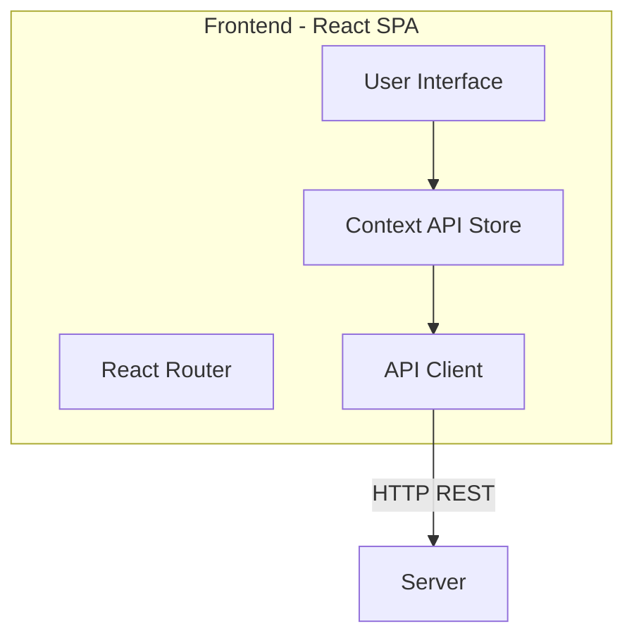

# Client Architecture

## Overview

The client is architected as a **Modular SPA** where each feature (Tasks, Habits, Analytics) is self-contained in terms of components, but shares a global state for Authentication and User Preferences.

## High-Level Diagram

## Core Layers

### 1. View Layer (Components & Pages)
- **Pages**: Container components that handle data fetching and layout (e.g., `Tasks.jsx`, `Dashboard.jsx`).
- **Components**: Presentational components that receive data via props (e.g., `TaskCard.jsx`, `StatsCard.jsx`).
- **Layouts**: `DashboardLayout` manages the persistent Sidebar and Navbar.

### 2. State Layer (Context API)
- **AuthContext**: Manages User Session (`user`, `token`, `login`, `logout`).
- **ThemeContext**: Manages UI Theme (`light`/`dark`).
- **SocketContext**: Manages Real-time connection.

### 3. Service Layer (API)
- **Axios Instance**: Centralized configuration in `src/api/axios.js`.
- **Interceptors**: Automatically attach `Authorization` headers.

## Key Workflows

### Authentication
1. User logs in -> `AuthContext` receives token.
2. Token stored in `localStorage`.
3. `axios` interceptor picks up token for next requests.
4. `DashboardLayout` checks `user` state; redirects to `/login` if null.

### Real-Time Updates
1. `SocketContext` establishes connection on mount.
2. Listens for events like `notification`.
3. Triggers `react-hot-toast` to show alert.
4. Logic avoids "zombie" connections by cleaning up on unmount.

[← Back to Main Documentation](../../README.md)
