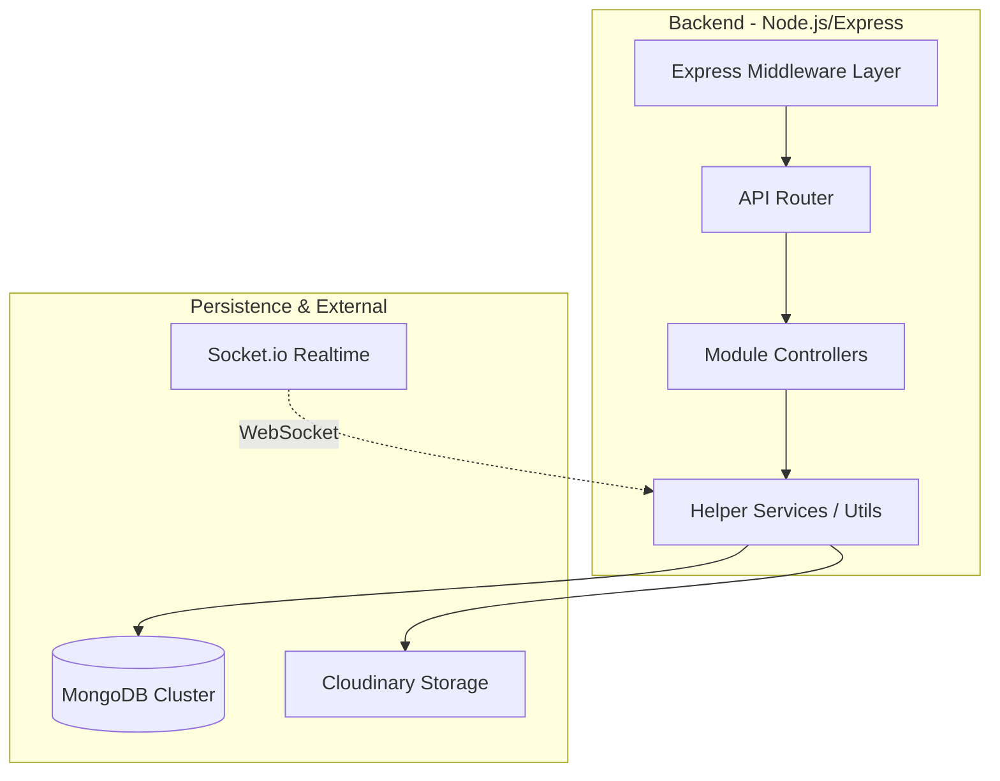

# Server Architecture

## Overview

The backend follows a **Modular Monolith** pattern. Features are grouped by domain (`auth`, `tasks`, `habits`, `analytics`) rather than technical role, keeping related logic together.

## High-Level Diagram

## Core Layers

### 1. Middleware Layer
- **Global**: `helmet`, `cors`, `rateLimit`, `mongoSanitize`.
- **Route-Specific**: `auth.protect` (JWT verification), `upload` (Multer), `validator`.

### 2. Module Layer
Each module (e.g., `modules/tasks`) contains:
- **Controller**: Handles request/response logic.
- **Routes**: Defines URL endpoints.
- **Service/Utils**: (Optional) Encapsulates complex business logic.

### 3. Data Layer
- **Mongoose**: Provides schema validation and robust data modeling.
- **Indexes**: heavily used on `user`, `status`, `dueDate` for performance.

## Key Workflows

### Authentication Flow
1. User submits login credentials -> Controller.
2. `bcrypt` verifies hash.
3. `jwt` signs a token with `HS256`.
4. Response returns `{ token, user }`.

### Real-time Notification Flow
1. Event triggers (e.g., Task Reminder Job).
2. Service creates `Notification` document in DB.
3. Service calls `io.to(userId).emit('notification', data)`.
4. Client receives payload instantly.

[← Back to Main Documentation](../../README.md)
